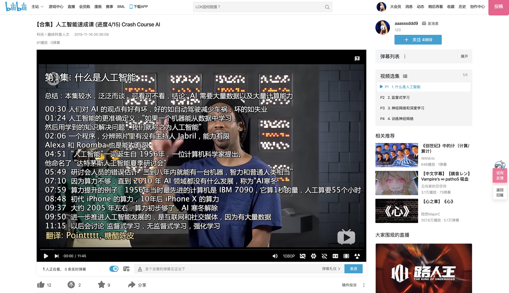
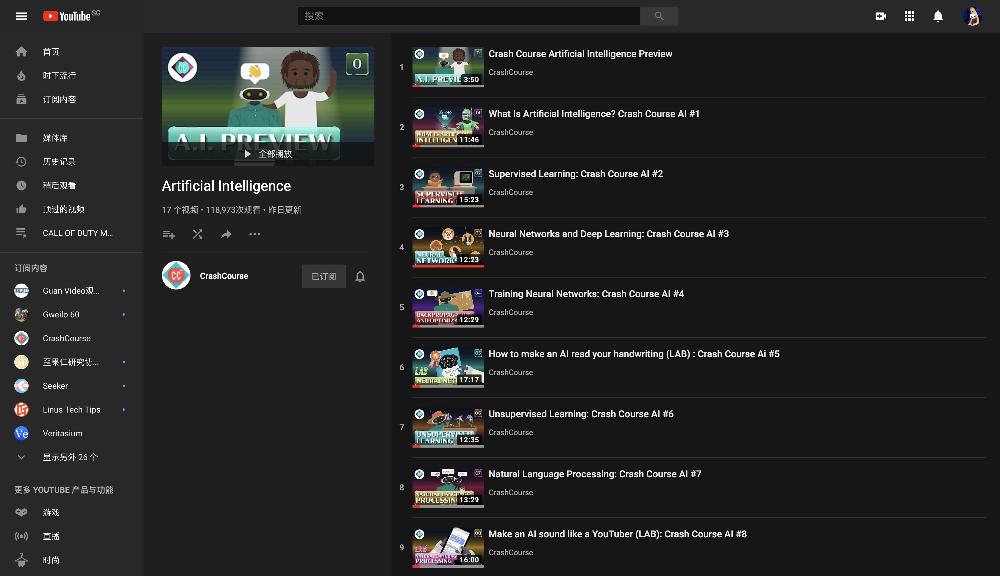
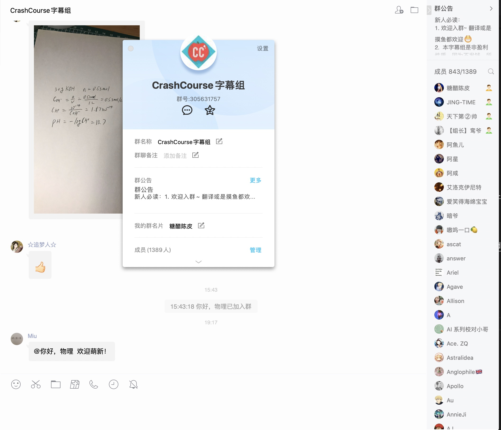

# 人工智能速成课 - 2019年新系列
[B站合集播放地址](https://www.bilibili.com/video/av75822322/)  

## 视频
* [1 - 什么是人工智能 | What Is Artificial Intelligence](https://www.bilibili.com/video/av74336721/)
* [2 - 监督式学习 | Supervised Learning](https://www.bilibili.com/video/av75707591/)
* [3 - 神经网络和深度学习 | Neural Networks and Deep Learning](https://www.bilibili.com/video/av75821839/)
* [4 - 训练神经网络 | Training Neural Networks](https://www.bilibili.com/video/av75892466)
* [5 - 如何让 AI 看懂你写的字 | How to make an AI read your handwriting (LAB)](https://www.bilibili.com/video/av76635688)
  * [补充资料1: Inside a Neural Network - Computerphile](https://www.youtube.com/watch?v=BFdMrDOx_CM)
* 6 Unsupervised Learning
* 7 Natural Language Processing
* 8 Make an AI sound like a YouTuber (LAB)
* 9 Reinforcement Learning
* 10 Symbolic AI
* 11 Robotic
* 12 AI Playing Games
* 13 Let's make an AI that destroys video games
* 14 Humans and AI working together
* 15 How YouTube knows what you should watch    
* 16 Let's make a movie recommendation system
* 17 Web Search
* 18 Algorithmic Bias and Fairness
* 19 Cats Vs Dogs? Let's make an AI to settle this
* 20 The Future of Artificial Intelligence

## 感谢所有参与翻译的人
排名不分先后   
* Pointtttt
* 二十四条鱼
* 速速束束木木
* 糖醋陈皮 - [Github](https://github.com/1c7/), [微博](https://www.weibo.com/u/2004104451)
* 이진(Eazin)
* 国土安全局
* MochaMilk
* wAtcher
* Pr1p   

## 视频来源
https://www.youtube.com/watch?v=6nGCGYWMObE&list=PL8dPuuaLjXtO65LeD2p4_Sb5XQ51par_b&index=1

## 时间
开始翻译: 2019年11月   

## Crash Course 字幕组信息  

    
QQ群: 305631757    
围观/翻译都欢迎加群
